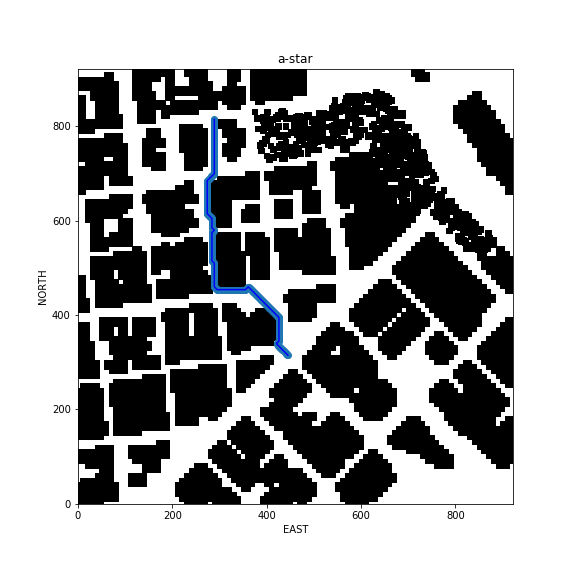
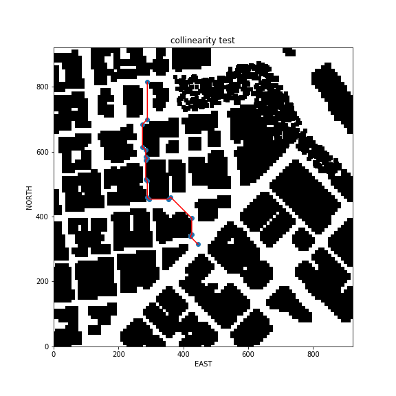
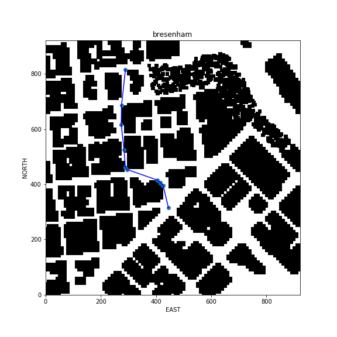

## Project: 3D Motion Planning

---

# Required Steps for a Passing Submission:
1. Load the 2.5D map in the colliders.csv file describing the environment.
2. Discretize the environment into a grid or graph representation.
3. Define the start and goal locations.
4. Perform a search using A* or other search algorithm.
5. Use a collinearity test or ray tracing method (like Bresenham) to remove unnecessary waypoints.
6. Return waypoints in local ECEF coordinates (format for `self.all_waypoints` is [N, E, altitude, heading], where the drone’s start location corresponds to [0, 0, 0, 0].
7. Write it up.
8. Congratulations!  Your Done!

## [Rubric](https://review.udacity.com/#!/rubrics/1534/view) Points
### Here I will consider the rubric points individually and describe how I addressed each point in my implementation.  

---
### Writeup / README

#### 1. Provide a Writeup / README that includes all the rubric points and how you addressed each one.  You can submit your writeup as markdown or pdf.  

You're reading it! Below I describe how I addressed each rubric point and where in my code each point is handled.

### Explain the Starter Code

#### 1. Explain the functionality of what's provided in `motion_planning.py` and `planning_utils.py`
First script contains the original code from the first project. The main difference is how calculated the path which will follow the drone.
In the first project the path was hardcoded as a array of local points. Here we need to calculate the optimal path using only two points in global coordinates.

Here's | A | Snappy | Table
--- | --- | --- | ---
1 | `highlight` | **bold** | 7.41
2 | a | b | c
3 | *italic* | text | 403
4 | 2 | 3 | abcd

### Implementing Your Path Planning Algorithm

#### 1. Set your global home position
First of all I read from the file `colliders.csv` the start point (latitude, longitude) and set the home position (see line# 135)

And here is a lovely picture of our downtown San Francisco environment from above!

#### 2. Set your current local position

Here as long as you successfully determine your local position relative to global home you'll be all set. Explain briefly how you accomplished this in your code.

Meanwhile, here's a picture of me flying through the trees!

#### 3. Set grid start position from local position (see line #147)
Here need to calculate two values: north_offset and east_offset. After that subtract from the local_position. The file `colliders.csv` contains data about obstacle sizes and the center coords.
Coords values are positive and negative because there are calculated against the grid center, so why need to calculate offset in **north** and **east**.  

#### 4. Set grid goal position from geodetic coords
The grid goal position can be calculated from (lat, lon) just using the Drone API function `global_to_local`

#### 5. Modify A* to include diagonal motion (or replace A* altogether)
I modified the A* implementation and add the diagoanal motions with a cost of sqrt(2). Actually tried three different versions of heuristic functions and decided impalement the Chebyshev distance 
how was explained [here](http://theory.stanford.edu/~amitp/GameProgramming/Heuristics.html#diagonal-distance).

#### 6. Cull waypoints 
That was most challenged part of the project. The A* algorithm returns a list of waypoints which drone will visit and stop in each waypoint. Obviously this is not effective approach and need somehow 
optimise that. 

First of all I tried to use the colliniarity feature from the udacity lesson. 

But result is not good for me because the path looks not optimal and effective.

So I decided to realize the Bresenham algorithm.
) 
So now it looks much more better!

### Execute the flight
#### 1. Does it work?
It works!

### Double check that you've met specifications for each of the [rubric](https://review.udacity.com/#!/rubrics/1534/view) points.
  
# Extra Challenges: Real World Planning

For an extra challenge, consider implementing some of the techniques described in the "Real World Planning" lesson. You could try implementing a vehicle model to take dynamic constraints into account, or implement a replanning method to invoke if you get off course or encounter unexpected obstacles.